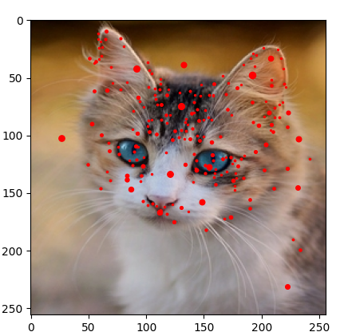

# Image_Matching
* Implementation and testing of computer vision image matching algorithms

* This project consists of 3 modules:  

    1-**main.ipynb**  : main program  

    2-**mainwindow.py** : Pyqt GUI script  

    3-**Utilities Folder** : contains the implementation of the used functions 

    4-**Harris.py**: contains the implementation of the Harris Algorithm  

    5-**SIFT.py** : contains the implementation of the SIFT Descriptors Algorithm  

    6-**FeatureMatching.py** : contains the implementation the matching using SSD and normalised correlation 
	
------
  # Libraries Versions 

  - cv2 : version 4.5.5.64
  - matplotlib : version 3.3.4
  - scipy :  version 1.6.2
  - numpy :  version 1.22.2

  ------
# How to run the application

  - In Vs code terminal you will run the command python main.py 
  
  
  - Then the UI will appear. Fisrt you will import image from images folder and choose one of Harris images (eg: Harris.jpeg), Then click on Show harris button.
  
  - On Feature Matching tab also you will import image from images folder (eg:Sift.jpg or Sift2.jpg) then import template (eg:Sift_ori.jpg or Sift2_ori.jpg). Finally when you click on import template it will take very short time then the results of feature matching using SSD and NCC will appear in the wigdets.
   

# Program description

- Browse an image from image folder (According to requirement that we want to apply (Ex: Harris.jpg for applying Harris ... )
------

# Results

1- **Harries Algorithm**

The Harris Detector is one of the many existing detectors that can be used to find key points in images. Corners are common key points that the detector tries to look for because there are significant changes in intensity in all directions.
- Original image

  

- After Applying Harris Algorithm

  
  
- Original image

  

- After Applying Harris Algorithm

  

- Original image

  

- After Applying Harris Algorithm

  
-------
2- **SIFT Algorithm**

Scale-Invariant Feature Transform (SIFT) is another technique for detecting local features.

- **Main difference between Harris and SIFT :**

 The Harris Detector, shown above, is rotation-invariant, which means that the detector can still distinguish the corners even if the image is rotated. However, the Harris Detector cannot perform well if the image is scaled differently.The SIFT detector is rotation-invariant and scale-invariant.

  

  
  

------
3 - **Feature matching**
- Using SSD

  

- Using Normalized Correlation

  

- Using SSD

  

- Using Normalized Correlation

  

---------

# Execution times: 
 - Harris Algorithm

  
 
  - SIFT

  
  
 - Feature matching using SSD

  

 - Feature matching using Normalized correlation

  
